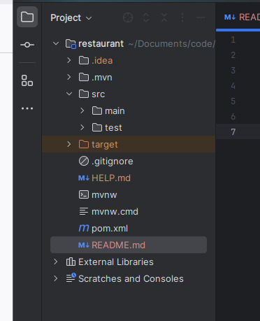
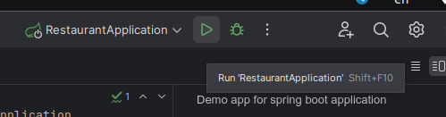
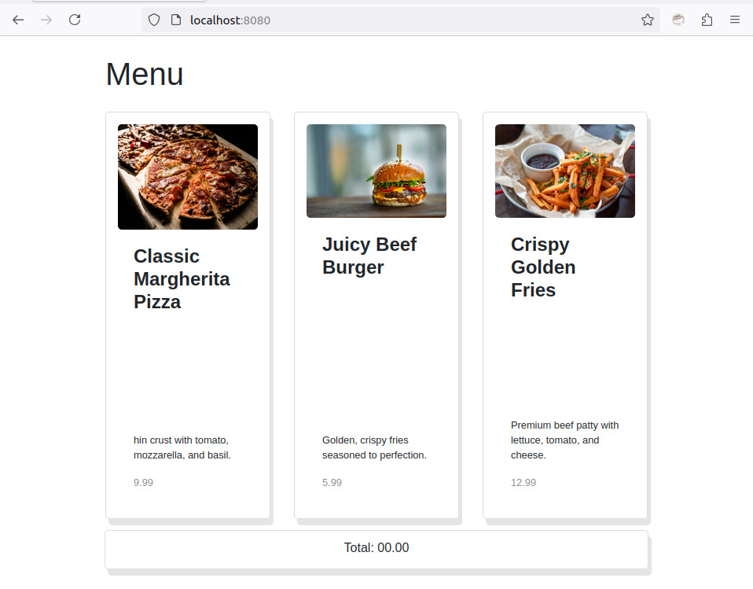

# What is this
Demo app for spring boot application

# How to run locally?
Assuming you are using intelliJ,

1. Open the code in intellij  

2. Click button to run  
   

3. Go to http://localhost:8080/  
   